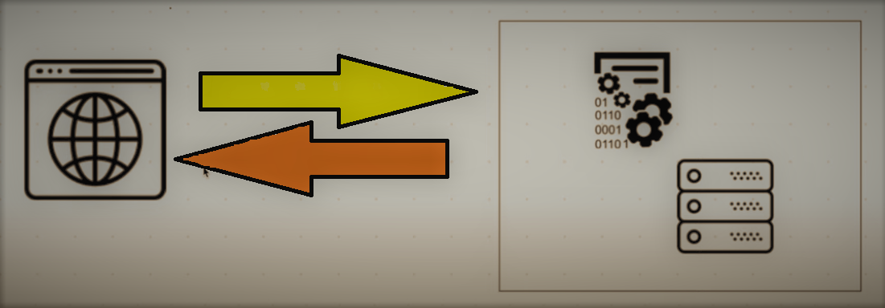
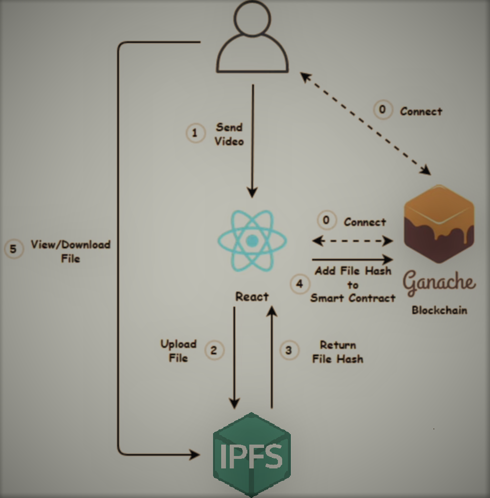
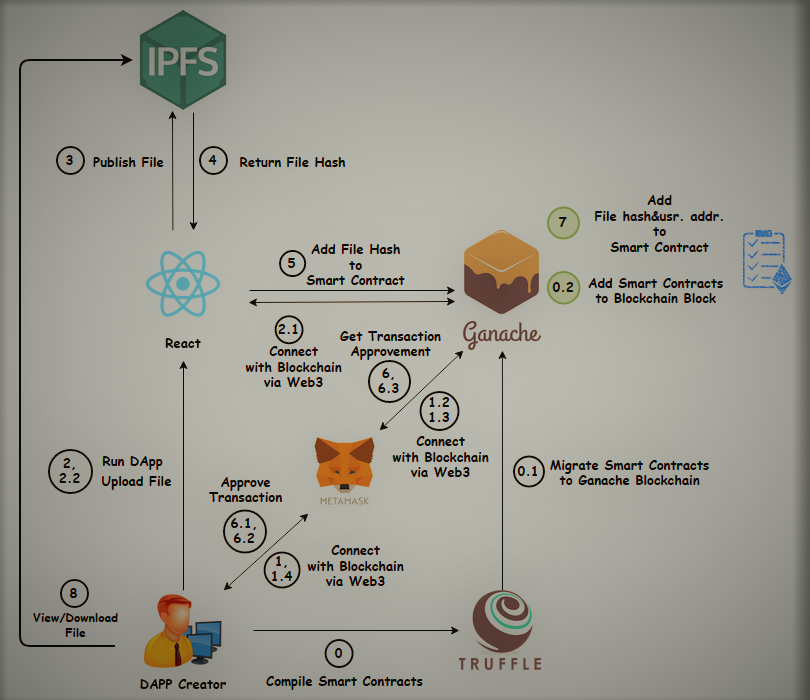

# DROPBOX - Clone BlockChain

This project is a decentralized dropbox clone that runs in the blockchain and the interplanetary file system IPFS. This will allow us to upload files decentralized and share them with others in a trustless, censorship-resistant fashion. Let’s look at how this application will work, so here's a quick diagram of how a traditional web application would work. 

Let's say dropbox, for example, so when you use the dropbox website, you know you get on your web browser and you talk to a server, and this is where all the code and the data and all the files for dropbox live you know on the central server, so all the backend logic is you know inside of an application like the one shown below, all the codes in a database and all the files also live here too, and when you store files in the cloud in this way this is a very centralized model so any of your files can be censored at any time and you also have to pay to store files here for a long term basis.

But by contrast, here's how the blockchain-based dropbox clone application will
work. So instead of, you know, talking to a web server, a centralized version of dropbox,
a decentralized version is where you use your web browser, and you connect with a blockchain wallet to the blockchain, and this is where we will store all the code for our application inside of smart contracts, we're going to use Ethereum for this project. So, we'll write Ethereum smart contracts to store the files' location and then store these files on the interplanetary file system (IPFS).

Now, what is IPFS?
This will work a lot like a blockchain, but it's a different way of storing files also decentralized, and this will allow us to store these files here for free for the long term, and then also they'll be censorship-resistant no major party can take them down. More technically speaking, The Inter-Planetary File System (IPFS) is a protocol and peer-to-peer network for storing and sharing data in a distributed file system. IPFS uses content-addressing to uniquely identify each file in a global namespace connecting all computing devices. Here is a technical diagram given below, of how this application will work so these are all the technologies we'll use to build this application. 

Basically, a user will interact with the application that we build and React.js, and this application will talk to the blockchain, so we're going to talk to Ethereum in this project, and we'll use a blockchain called the ganache, which is a development version of Ethereum and our React application will also talk to IPFS, whenever we upload files. So, we'll upload files to IPFS. We'll develop smart contracts that store the location of these files and put them on ganache, allowing the user to view and download files from this React application and upload and store them, so here's an even more technical diagram.

